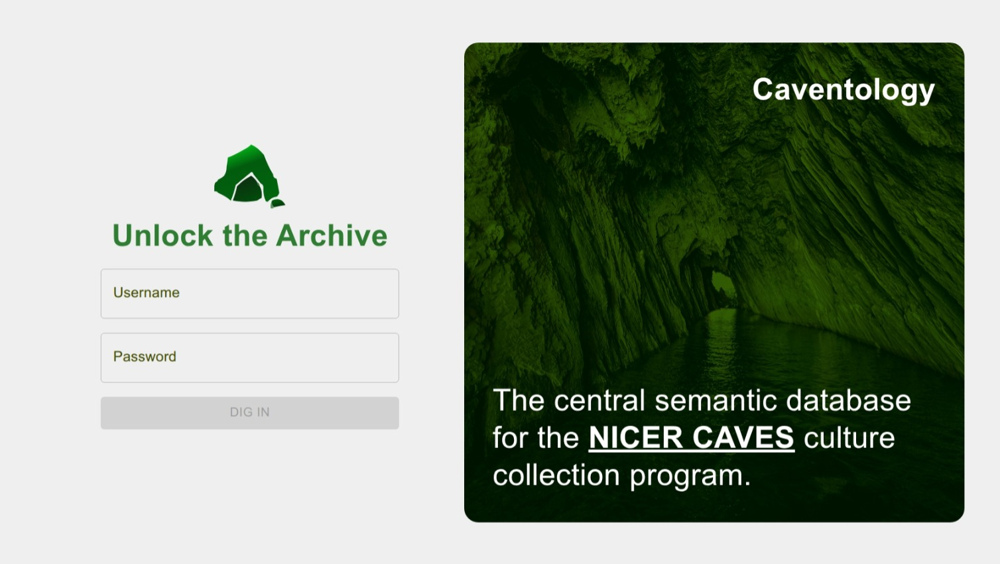
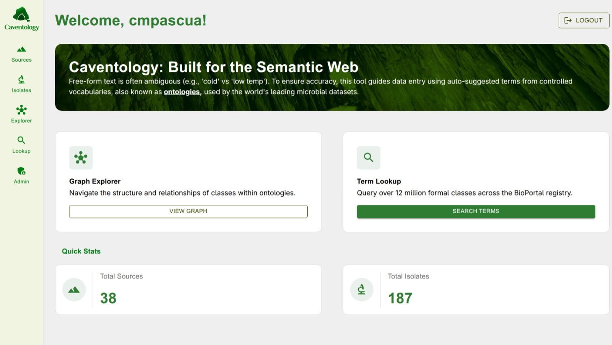
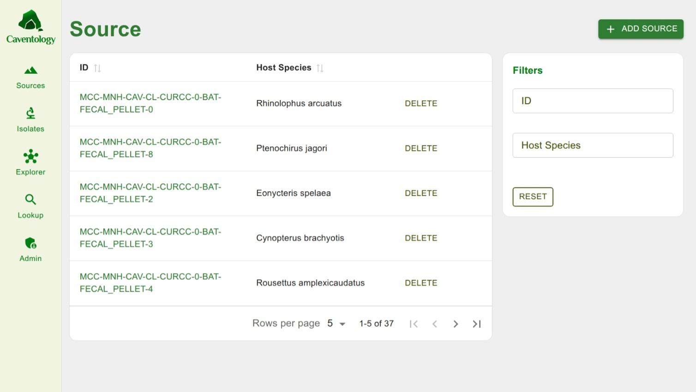
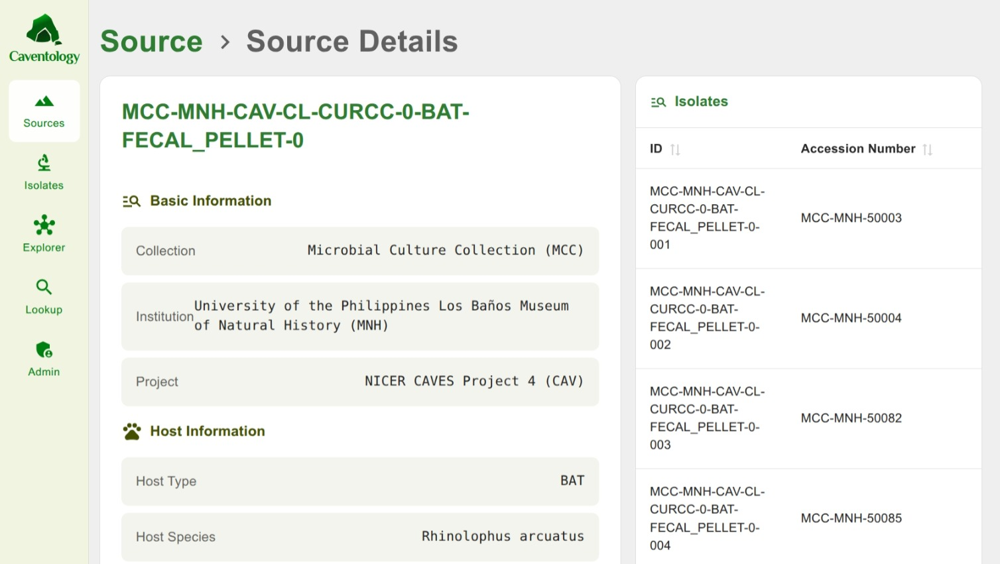
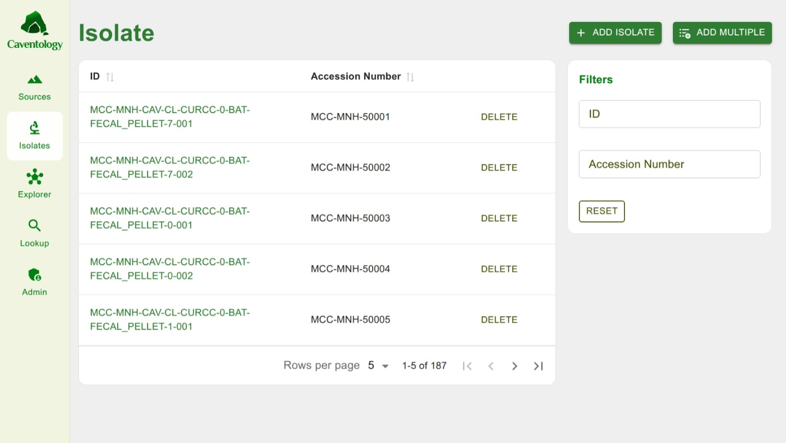
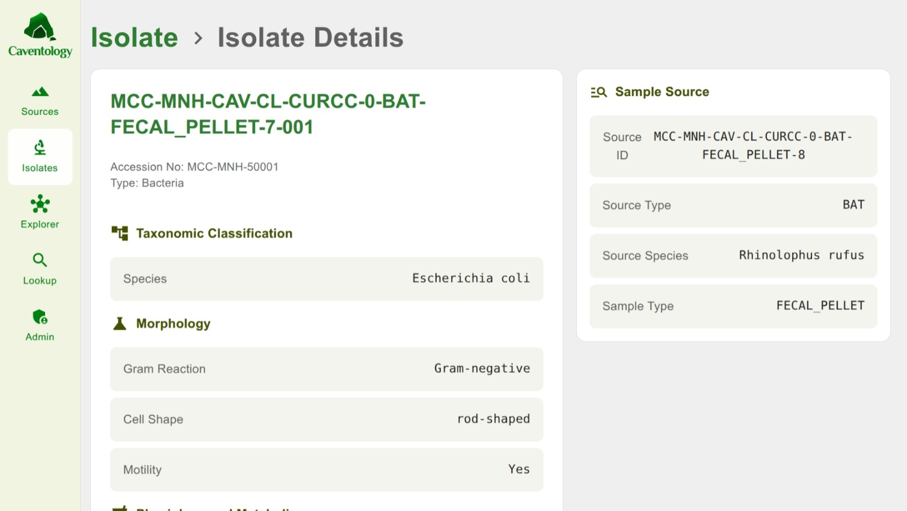
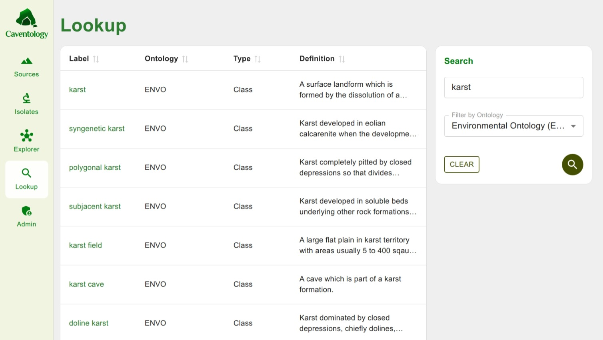
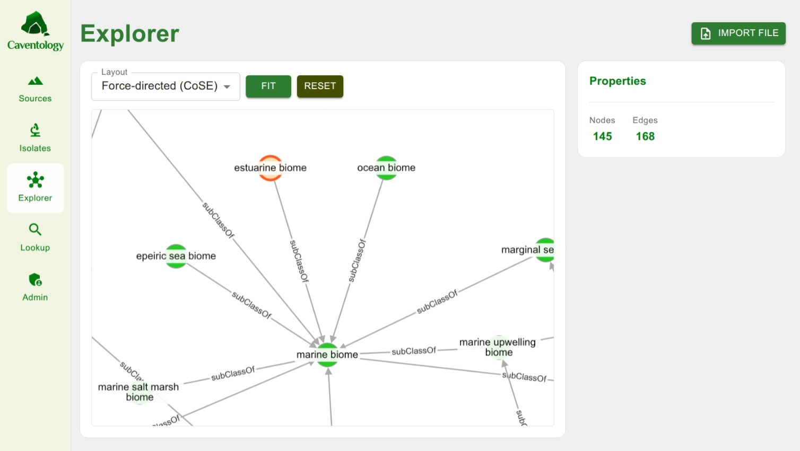
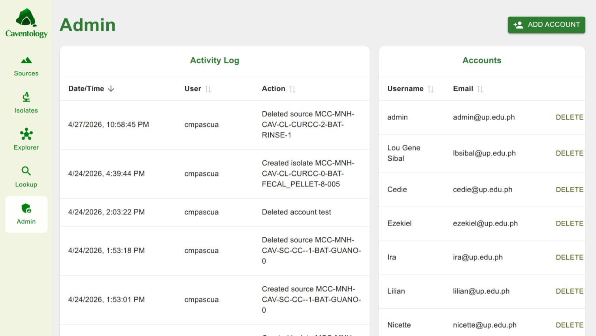

# An Ontology-Guided Approach for Enhanced Documentation of Cave Microbial Culture Collections

## 📌 Overview

**Inconsistent documentation** severely limits the scientific value of cave microbial data, making records difficult to interpret, compare, and integrate.

Researchers using the *2023 CaveIS platform* frequently encounter this issue because the system relies heavily on free-text annotations, which are highly prone to ambiguity and inconsistency.

To address this, this study developed **Caventology**—a web application built on top of the existing cave culture collection information system that integrates **ontology-based suggestions** for selected annotation fields to improve the consistency and semantic quality of data.

  

---

## 🛠️ Key Features & Services

* **Ontology-Guided Suggestions:** Dynamic, contextual terms for selected annotation fields implemented via the **BioPortal Search API**.
* **Ontology Lookup Service (OLS):** Allows users to search for specific ontology terms and view explicit definitions.
* **Ontology Explorer Service (OES):** Enables users to examine complex semantic relationships. Built by parsing RDF ontology files using **N3.js** and visualizing them interactively with **Cytoscape.js**.

---

## 📊 Evaluation & Results

The system was evaluated by fifteen (15) survey participants, including project stakeholders and researchers from various science disciplines, using the System Usability Scale (SUS).

* **Mean SUS Score:** **79** (Indicates strong usability and acceptance)
* **Conclusion:** Caventology offers a practical, robust approach to improving the consistency and semantic clarity of cave microbial culture data.

---

## 📂 Project Resources & Media

* 📄 **[Read the Full Journal Paper](https://cmpascua.github.io/caventology-journal/CMSC190_CJMPascua_journal.pdf)**
* 🖼️ **[View the Project Poster](https://cmpascua.github.io/caventology-journal/CMSC190_CJMPascua_poster.pdf)**

### 📺 Video Demos by User Action

Select a link below to watch how to use each core service of the Caventology application:

* 🎥 **[Demo: Login Page](https://youtu.be/z11qoV4Nvzg?si=7gJX45sGY-TD8RVc)**
  
  
* 🎥 **[Demo: Home Page](https://youtu.be/ufbXKvAJpeg?si=HQsa8NA-JmE_vFOu)**
  
  
* 🎥 **[Demo: Source Records Page](https://youtu.be/dFso6Z_yXcY?si=YYVeRPXaB0BEi1v0)**
  
  
* 🎥 **[Demo: Source Details Page](https://youtu.be/flOGXwkhISs?si=fZ2sdX2d9N-I2h8C)**
  
  
* 🎥 **[Demo: Isolate Records Page](https://youtu.be/d-jV6FWZXUc?si=pMX8ePPoIFLFT12b)**
  
  
* 🎥 **[Demo: Isolate Details Page](https://youtu.be/wr6ZyrHu9V0?si=uJqPiHXHcpDnyiGO)**
  
  
* 🎥 **[Demo: Ontology Lookup Service (OLS) Page](https://youtu.be/fQ5jMQIui3M?si=GnarhdJEFFOsuUqt)**
  
  
* 🎥 **[Demo: Ontology Explorer Service (OES) Page](https://youtu.be/w_FTzE7gQG8?si=kwWacETA4LPV8V4T)**
  
  
* 🎥 **[Demo: Admin Page](https://youtu.be/mQKDn11Uzj4?si=4kKKLaFMMyD_iWKG)**
  
---

## 🏷️ Index Terms

`ontology-guided documentation` • `cave microbiology` • `microbial culture collection` • `BioPortal` • `semantic web`

---

## 📚 References

1. **[patel]** S. K. S. Patel and J.-K. Lee, “Plastic Eating Enzymes: A Step Towards Sustainability,” *Indian Journal of Microbiology*, vol. 62, no. 4, pp. 658–661, Sep. 2022, doi: [10.1007/s12088-022-01041-w](https://doi.org/10.1007/s12088-022-01041-w).
2. **[winn]** Z. Winn, “Turning microbiome research into a force for health,” *MIT News Massachusetts Institute of Technology*, Jan. 05, 2021. [Link](https://news.mit.edu/2021/microbiome-research-health-0105).
3. **[alcazar]** S. Alcazar et al., “Cave bats and their habitats in Nug-as and Mt. Lantoy key biodiversity area (KBA), Cebu, Philippines,” vol. 25, pp. 621–637, Jan. 2016.
4. **[iucn]** IUCN SSC, Ed., “IUCN SSC Guidelines for Minimizing the Negative Impact to Bats and Other Cave Organisms from Guano Harvesting,” Mar. 2014. Available: [PDF Document](https://portals.iucn.org/library/sites/library/files/documents/Rep-2014-002.pdf).
5. **[deleon]** M. P. De Leon, A-young. Park, A. D. Montecillo, M. A. T. Siringan, A. R. R. Rosana, and S.-G. Kim, “Near-Complete Genome Sequences of *Streptomyces* sp. Strains AC1-42T and AC1-42W, Isolated from Bat Guano from Cabalyorisa Cave, Mabini, Pangasinan, Philippines,” *Microbiology Resource Announcements*, vol. 7, no. 7, Aug. 2018, doi: [10.1128/mra.00904-18](https://doi.org/10.1128/mra.00904-18).
6. **[sakoui]** Souraya Sakoui et al., “The first study of probiotic properties and biological activities of lactic acid bacteria isolated from Bat guano from Er-rachidia, Morocco,” *Lebensmittel-Wissenschaft + Technologie/Food science & technology*, vol. 159, pp. 113224–113224, Apr. 2022, doi: [10.1016/j.lwt.2022.113224](https://doi.org/10.1016/j.lwt.2022.113224).
7. **[fedurek]** Pawel Fedurek et al., “Selective deforestation and exposure of African wildlife to bat-borne viruses,” *Communications biology*, vol. 7, no. 1, Apr. 2024, doi: [10.1038/s42003-024-06139-z](https://doi.org/10.1038/s42003-024-06139-z).
8. **[dumschott]** K. Dumschott et al., “Ontologies for increasing the FAIRness of plant research data,” *Front. Plant Sci.*, vol. 14, Nov. 2023, doi: [10.3389/fpls.2023.1279694](https://www.google.com/search?q=https://doi.org/10.3389/fpls.2023.1279694).
9. **[jensen]** L. J. Jensen and P. Bork, “Ontologies in Quantitative Biology: A Basis for Comparison, Integration, and Discovery,” *PLoS Biology*, vol. 8, no. 5, p. e1000374, May 2010, doi: [10.1371/journal.pbio.1000374](https://doi.org/10.1371/journal.pbio.1000374).
10. **[ashburner]** M. Ashburner et al., “Gene Ontology: tool for the unification of biology,” *Nature Genetics*, vol. 25, no. 1, pp. 25–29, May 2000, doi: [10.1038/75556](https://doi.org/10.1038/75556).
11. **[rubin]** D. L. Rubin, N. H. Shah, and N. F. Noy, “Biomedical ontologies: a functional perspective,” *Briefings in Bioinformatics*, vol. 9, no. 1, pp. 75–90, Oct. 2007, doi: [10.1093/bib/bbm059](https://doi.org/10.1093/bib/bbm059).
12. **[federhen]** S. Federhen, “The NCBI Taxonomy database,” *Nucleic Acids Research*, vol. 40, no. D1, pp. D136–D143, Dec. 2011, doi: [10.1093/nar/gkr1178](https://doi.org/10.1093/nar/gkr1178).
13. **[gkoutos]** G. V. Gkoutos, P. N. Schofield, and R. Hoehndorf, “The anatomy of phenotype ontologies: principles, properties and applications,” *Briefings in Bioinformatics*, vol. 19, no. 5, pp. 1008–1021, Apr. 2017, doi: [10.1093/bib/bbx035](https://doi.org/10.1093/bib/bbx035).
14. **[bandrowski]** A. Bandrowski et al., “The Ontology for Biomedical Investigations,” *PLOS ONE*, vol. 11, no. 4, p. e0154556, Apr. 2016, doi: [10.1371/journal.pone.0154556](https://doi.org/10.1371/journal.pone.0154556).
15. **[buttigieg]** Pier Luigi Buttigieg, Evangelos Pafilis, S. E. Lewis, M. Schildhauer, R. Walls, and C. J. Mungall, “The environment ontology in 2016: bridging domains with increased scope, semantic density, and interoperation,” *Journal of Biomedical Semantics*, vol. 7, no. 1, Sep. 2016, doi: [10.1186/s13326-016-0097-6](https://doi.org/10.1186/s13326-016-0097-6).
16. **[reimer]** L. C. Reimer, J. Sardà Carbasse, J. Koblitz, C. Ebeling, A. Podstawka, and J. Overmann, “BacDive in 2022: the knowledge base for standardized bacterial and archaeal data,” *Nucleic Acids Research*, vol. 50, no. D1, pp. D741–D746, Oct. 2021, doi: [10.1093/nar/gkab961](https://doi.org/10.1093/nar/gkab961).
17. **[nix]** T. Nix, “Research Guides: Biomedical Ontologies and Controlled Vocabularies: Overview.” Accessed: Nov. 22, 2024. Available: [University of Michigan Library](https://guides.lib.umich.edu/ontology/overview).
18. **[gross]** A. Groß, C. Pruski, and E. Rahm, “Evolution of biomedical ontologies and mappings: Overview of recent approaches,” *Computational and Structural Biotechnology Journal*, vol. 14, pp. 333–340, Jan. 2016, doi: [10.1016/j.csbj.2016.08.002](https://www.google.com/search?q=https://doi.org/10.1016/j.csbj.2016.08.002).
19. **[verborgh]** R. Verborgh et al., “rdfjs/n3.js: v2.0.3,” *Zenodo*, Mar. 2024, doi: [10.5281/zenodo.10866356](https://www.google.com/search?q=https://doi.org/10.5281/zenodo.10866356).
20. **[franz]** M. Franz, C. T. Lopes, G. Huck, Y. Dong, O. Sumer, and G. D. Bader, “Cytoscape.js: a graph theory library for visualisation and analysis,” *Bioinformatics*, vol. 32, no. 2, pp. 309–311, Sep. 2015, doi: [10.1093/bioinformatics/btv557](https://www.google.com/search?q=https://doi.org/10.1093/bioinformatics/btv557).
21. **[trissl]** S. Trißl and U. Leser, “Querying Ontologies in Relational Database Systems,” *Lecture Notes in Computer Science*, pp. 63–79, 2005, doi: [10.1007/11530084_7](https://www.google.com/search?q=https://doi.org/10.1007/11530084_7).
22. **[laurenne]** N. Laurenne, J. Tuominen, Hannu Saarenmaa, and Eero Hyvönen, “Making species checklists understandable to machines – a shift from relational databases to ontologies,” *Journal of Biomedical Semantics*, vol. 5, no. 1, pp. 40–40, Jan. 2014, doi: [10.1186/2041-1480-5-40](https://doi.org/10.1186/2041-1480-5-40).
23. **[whetzel]** P. L. Whetzel et al., “BioPortal: enhanced functionality via new Web services from the National Center for Biomedical Ontology to access and use ontologies in software applications,” *Nucleic Acids Research*, vol. 39, no. suppl, pp. W541–W545, Jun. 2011, doi: [10.1093/nar/gkr469](https://www.google.com/search?q=https://doi.org/10.1093/nar/gkr469).
24. **[splendiani]** A. Splendiani, A. Burger, A. Paschke, P. Romano, and M. S. Marshall, “Semantic Web, Ontology, and Linked Data.” Accessed: Nov. 22, 2024. Available: [IGI Global Gateway](https://www.google.com/search?q=https://www.igi-global.com/gateway/chapter/174331).
25. **[bernerslee]** T. Berners-Lee and J. Hendler, “Publishing on the semantic web,” *Nature*, vol. 410, no. 6832, pp. 1023–1024, Apr. 2001, doi: [10.1038/35074206](https://doi.org/10.1038/35074206).
26. **[mukherjee]** S. Mukherjee et al., “Twenty-five years of Genomes OnLine Database (GOLD): data updates and new features in v.9,” *Nucleic Acids Research*, vol. 51, no. D1, pp. D957–D963, Jan. 2023, doi: [10.1093/nar/gkac974](https://www.google.com/search?q=https://doi.org/10.1093/nar/gkac974).
27. **[garcia]** N. H. Garcia, A. Jacildo, and M. R. Anacleto, “Cave Microbiome Database: A Database System for Cave Microorganism Data in the Philippines”.
